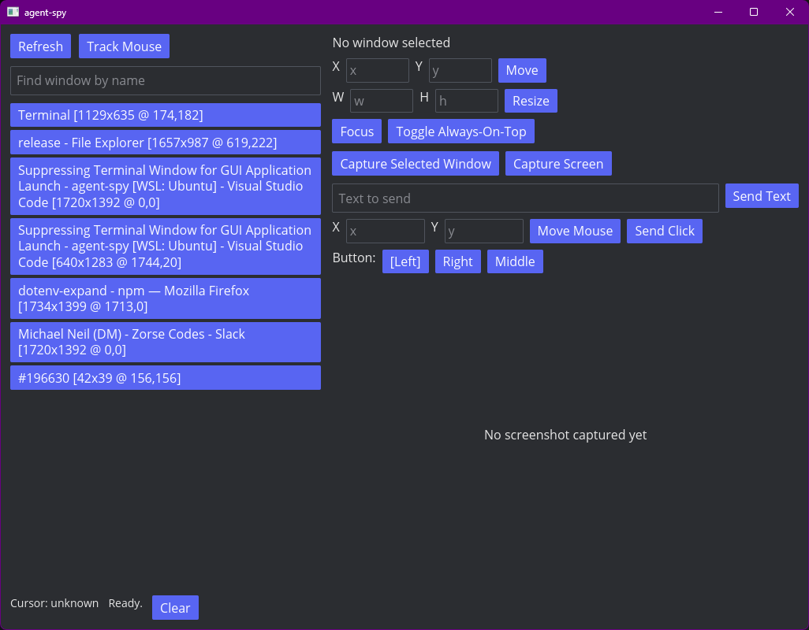

# agent-spy

WinSpy inspired tool for Agents - The last desktop automation tool your Agents need. Lets you or your agent take over your desktop, an existing Window, a browser Tab, or anything else with a GUI.

## Build

Use the package scripts to drive Cargo builds:

- `npm run build` builds the native target for the current machine.
- `npm run build:release` builds a native release binary.
- `npm run build:linux` builds a Linux release binary.
- `npm run build:windows` builds a Windows release binary.
- `npm run build:xwindows` cross-builds a Windows release binary from non-Windows hosts.
- `npm run build:macos` builds an Apple Silicon macOS release binary.
- `npm run build:macos:intel` builds an Intel macOS release binary.
- `npm run verify` runs `cargo check` and `cargo test`.

Cross-target scripts require the corresponding Rust target toolchain to be installed.

## CLI Mode

Run command mode with `--cli`. Without `--cli`, the GUI launches as usual.

Examples:

- `cargo run -- --cli list-windows`
- `cargo run -- --cli list-windows --search firefox`
- `cargo run -- --cli window-info 12345`
- `cargo run -- --cli move 12345 100 200`
- `cargo run -- --cli resize 12345 1280 720`
- `cargo run -- --cli always-on-top 12345 on`
- `cargo run -- --cli capture-screen --output /tmp/screen.png`
- `cargo run -- --cli capture-window 12345 --output /tmp/window.png`
- `cargo run -- --cli send-text "hello from cli"`
- `cargo run -- --cli move-mouse 500 300`
- `cargo run -- --cli click 500 300 --button left`
- `cargo run -- --cli check-permissions`

Commands:

- `list-windows [--search <query>]`
- `window-info <id>`
- `window-at-point <x> <y>`
- `cursor-position`
- `focus <id>`
- `move <id> <x> <y>`
- `resize <id> <width> <height>`
- `always-on-top <id> <on|off>`
- `capture-screen --output <path>`
- `capture-window <id> --output <path>`
- `send-text <text>`
- `move-mouse <x> <y>`
- `click <x> <y> [--button <left|right|middle>]`
- `check-permissions`
- `version`

Notes:

- `capture-screen` and `capture-window` require `--output`.
- Commands that manipulate windows require accessibility support.
- Input simulation commands require input simulation support.
- Linux GUI/CLI automation support is X11-only.
- Wayland sessions are intentionally unsupported; run `agent-spy` in an X11 session.
Patch scripts require `cargo patch-crate` (`cargo install patch-crate`).
