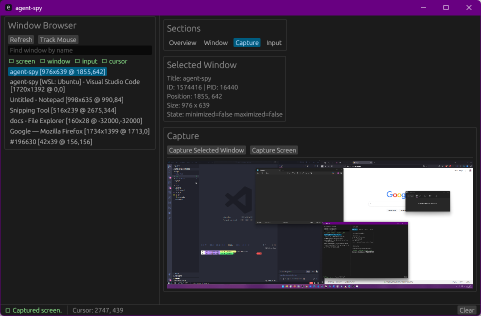
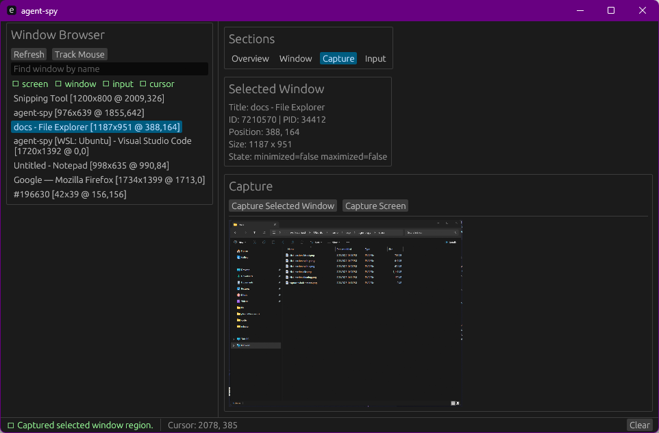
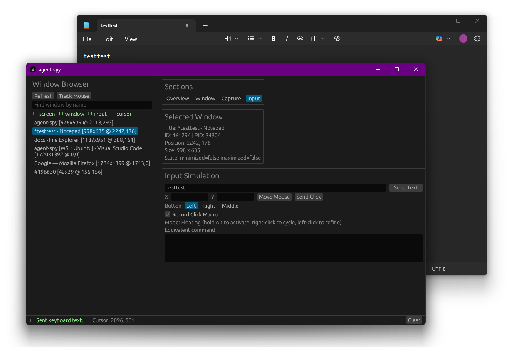
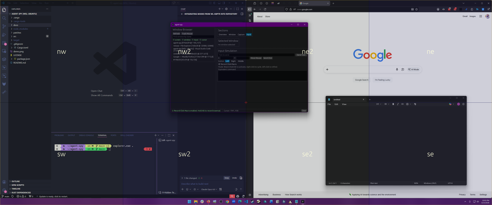
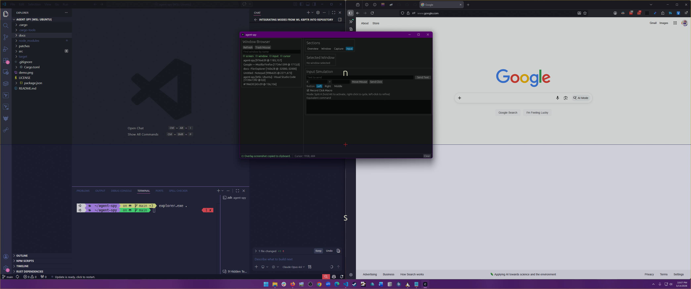
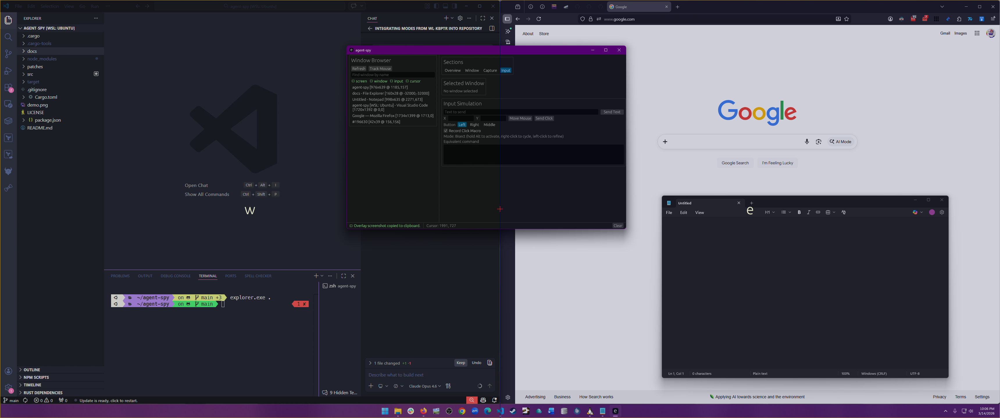
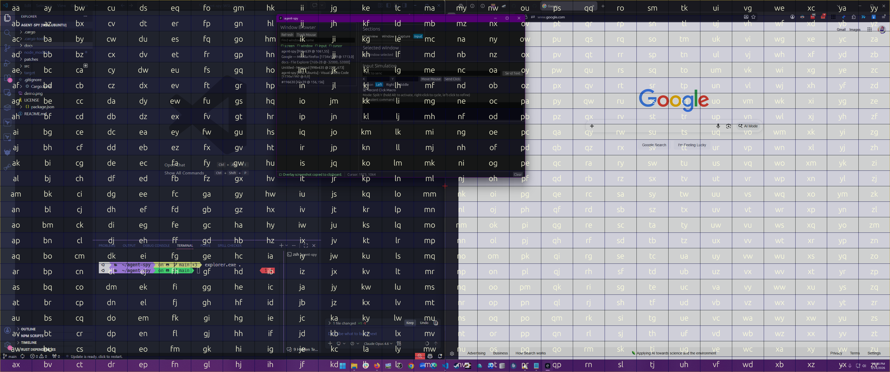
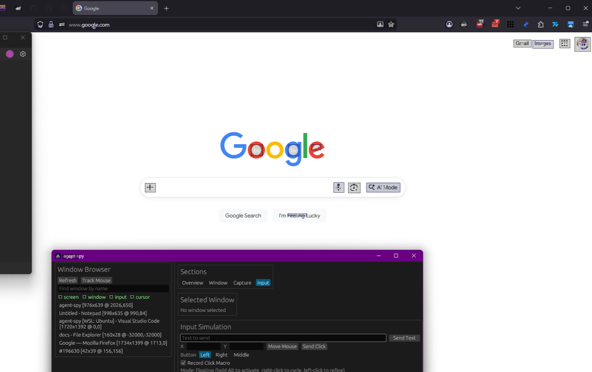

# agent-spy

WinSpy inspired tool for Agents - The last desktop automation tool your Agents need. Lets you or your agent take over your desktop, an existing Window, a browser Tab, or anything else with a GUI.

- [Features](#features)
  - [Screen \& Window Capture](#screen--window-capture)
  - [Input Simulation](#input-simulation)
  - [Click Macro Recording \& Overlay](#click-macro-recording--overlay)
  - [Window Management](#window-management)
- [Build](#build)
- [CLI Mode](#cli-mode)
- [Send Text Modes](#send-text-modes)
- [Permissions](#permissions)
  - [Allow agents to access Windows](#allow-agents-to-access-windows)
  - [Allow agents to access Mac](#allow-agents-to-access-mac)

## Features

### Screen & Window Capture

Capture the entire screen or a specific window. Screenshots are displayed inline and can be used for visual inspection or automation feedback.

**Capture Screen** takes a screenshot of the monitor containing the cursor. **Capture Selected Window** captures only the bounds of the selected window from the window list.





### Input Simulation

Send text, move the mouse, and click at specific coordinates. Choose between left, right, and middle mouse buttons.

The Input tab exposes two independent Send Text toggles:

- **Use focus-swap mode**
- **Use copy-paste mode**

These toggles combine to produce 4 deterministic Send Text behaviors (same matrix on all platforms):

| Focus-swap | Copy-paste | Behavior |
|---|---|---|
| Off | Off | Send keystrokes to selected window without focusing it. |
| On | Off | Focus selected window, send keystrokes, then restore previous focus. |
| Off | On | Copy text to clipboard, send paste command to selected window without focusing it. |
| On | On | Copy text to clipboard, focus selected window, paste, then restore previous focus. |

If no window is selected, Send Text is sent to the currently active/focused app.



## Send Text Modes

### Platform behavior

| Platform | Background Keystrokes (Off/Off) | Focus-swap Keystrokes (On/Off) | Background Paste (Off/On) | Focus-swap Paste (On/On) |
|---|---|---|---|---|
| Windows | ✅ | ✅ | ✅ | ✅ |
| Linux (X11) | ✅* | ✅ | ✅ | ✅ |
| macOS | ✅ | ✅ | ✅ | ✅ |

\* Linux X11 background keystrokes currently support ASCII text and spaces. For full Unicode reliability, use copy-paste mode.

### Notes

- Linux window control and background targeting require X11. Wayland sessions can still use focused input through Enigo when supported by the session, but window-target features remain X11-only.
- Background delivery may still be blocked by application-specific security/input models in some apps.

### Click Macro Recording & Overlay

Enable **Record Click Macro** to open the overlay with **Alt**. The overlay displays the current monitor as a frozen screenshot with interactive region subdivisions painted on top. Left-click to refine the selection, right-click to cycle through modes.

When Alt is released the traversal is recorded and an equivalent CLI command is generated. Click the command textarea to copy it to clipboard.

While the overlay is open, press **S** to save the current screen (with overlay graphics) to the clipboard as an image.

Five overlay modes are available:

| Mode | Description | Screenshot |
|------|-------------|------------|
| **Bisect** | Divides the region into four quadrants (nw, ne, sw, se). Repeatedly halves the area. |  |
| **Split-X** | Splits horizontally into west (w) and east (e) halves. |  |
| **Split-Y** | Splits vertically into north (n) and south (s) halves. |  |
| **Tile** | Divides the region into a labeled grid for quick coordinate targeting. |  |
| **Floating** | Uses computer vision (Canny edge detection + connected components) to detect clickable UI elements in the region and labels them alphabetically. |  |

Modes can be mixed freely during a single traversal. The recorded chain produces a CLI command like:

```
agent-spy --cli select-region --chain "bisect:nw,split-x:e,tile:5"
```

### Window Management

Move, resize, focus, and pin windows. The Window tab exposes position (X/Y), size (W/H), focus, and always-on-top controls for the selected window.


## Build

Use the package scripts to drive Cargo builds:

- `npm run build` builds the native target for the current machine.
- `npm run build:release` builds a native release binary.
- `npm run build:linux` builds a Linux release binary.
- `npm run build:windows` builds a Windows release binary.
- `npm run build:xwindows` cross-builds a Windows release binary from non-Windows hosts.
- `npm run build:macos` builds an Apple Silicon macOS release binary.
- `npm run build:macos:intel` builds an Intel macOS release binary.
- `npm run verify` runs `cargo check` and `cargo test`.

Cross-target scripts require the corresponding Rust target toolchain to be installed.

## CLI Mode

Run command mode with `--cli`. Without `--cli`, the GUI launches as usual.

Examples:

- `cargo run -- --cli list-windows`
- `cargo run -- --cli list-windows --search firefox`
- `cargo run -- --cli window-info 12345`
- `cargo run -- --cli move 12345 100 200`
- `cargo run -- --cli resize 12345 1280 720`
- `cargo run -- --cli always-on-top 12345 on`
- `cargo run -- --cli capture-screen --output /tmp/screen.png`
- `cargo run -- --cli capture-window 12345 --output /tmp/window.png`
- `cargo run -- --cli send-text "hello from cli"`
- `cargo run -- --cli key-down shift`
- `cargo run -- --cli key-tap a --mod control`
- `cargo run -- --cli move-mouse 500 300`
- `cargo run -- --cli click 500 300 --button left`
- `cargo run -- --cli mouse-down 500 300 --button left`
- `cargo run -- --cli mouse-up 500 300 --button left`
- `cargo run -- --cli drag 500 300 700 450 --button left`
- `cargo run -- --cli scroll -3 --axis vertical`
- `cargo run -- --cli check-permissions`
- `cargo run -- --cli select-region --chain "bisect:nw,split-x:e"`
- `cargo run -- --cli select-region --chain "tile:5,bisect:se" --button right`
- `cargo run -- --cli select-region --chain "bisect:nw" --dry-run`

Commands:

- `list-windows [--search <query>]`
- `window-info <id>`
- `window-at-point <x> <y>`
- `cursor-position`
- `focus <id>`
- `move <id> <x> <y>`
- `resize <id> <width> <height>`
- `always-on-top <id> <on|off>`
- `capture-screen --output <path>`
- `capture-window <id> --output <path>`
- `send-text [--window-id <id>] [--allow-focus-swap-fallback] <text>`
- `key-down <key>`
- `key-up <key>`
- `key-tap <key> [--mod <shift|control|alt|meta>]...`
- `move-mouse <x> <y>`
- `click <x> <y> [--button <left|right|middle>]`
- `mouse-down <x> <y> [--button <left|right|middle>]`
- `mouse-up <x> <y> [--button <left|right|middle>]`
- `drag <start_x> <start_y> <end_x> <end_y> [--button <left|right|middle>]`
- `scroll <amount> [--axis <vertical|horizontal>]`
- `select-region --chain <steps> [--button <left|right|middle>] [--dry-run]`
- `check-permissions`
- `version`

Notes:

- `capture-screen` and `capture-window` require `--output`.
- `select-region` chains mode:label steps to subdivide the screen and click the center of the resolved area. Use `--dry-run` to print the region without clicking. Modes: `bisect`, `split-x`, `split-y`, `tile`, `floating`.
- Commands that manipulate windows require accessibility support.
- Input simulation commands require input simulation support.
- Named keys supported by the low-level CLI include modifiers, arrows, enter, escape, tab, space, delete, home/end, page up/down, and `f1` through `f12`. Single-character keys are also supported.
- Linux input injection prefers native X11 XTest when available and falls back to Enigo.
- Wayland sessions are supported for input simulation when Enigo can access the session; window-management features remain X11-only.
Patch scripts require `cargo patch-crate` (`cargo install patch-crate`).

## Permissions

### Allow agents to access Windows

UIPI is a security measure that "prevents processes with a lower "integrity level" (IL) from sending messages to higher IL processes". If your program does not have elevated privileges, you won't be able to use this program in some situations. It won't be possible to use it with the task manager for example. Run this program as an admin, if you need to use it with processes with a higher "integrity level".

### Allow agents to access Mac

When a third-party app tries to access and control your Mac through accessibility features, you receive an alert, and you must specifically grant the app access to your Mac in Privacy & Security settings.

If you’re familiar with an app, you can authorize it by clicking Open System Settings in the alert, then turning on permission for the app in Privacy & Security settings. If you’re unfamiliar with an app or you don’t want to give it access to your Mac at that time, click Deny in the alert.

Be cautious and grant access only to apps that you know and trust. If you give apps access to your Mac, you also give them access to your contact, calendar, and other information, and are subject to their terms and privacy policies, and not the Apple Privacy Policy. Be sure to review an app’s terms and privacy policy to understand how it treats and uses your information.

To review app permissions—for example, if you later decide to give a denied app access to your Mac—choose Apple menu > System Settings, click Privacy & Security in the sidebar, then click Accessibility on the right. (You may need to scroll down.) Turn permission on or off for any app in the list. If you don’t see the app you want to grant permissions for, click the Add button at the bottom of the list of apps, search for the app, select it, then click Open.
